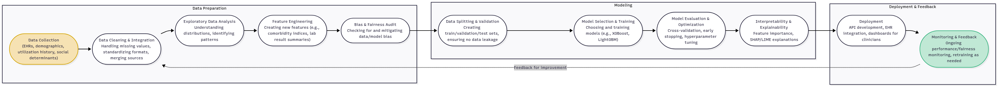

# Patient Readmission Risk Prediction

# Executive Summary

This document presents a comprehensive approach to predicting patient readmission risk within 30 days of hospital discharge using artificial intelligence. The project aims to help hospitals proactively identify high-risk patients, reduce unnecessary readmissions, improve patient outcomes, and optimize resource allocation. The solution leverages electronic health records (EHRs), demographic data, and advanced machine learning models—specifically, gradient boosting (XGBoost/LightGBM)—to deliver accurate, interpretable predictions. Key considerations include data privacy, regulatory compliance (e.g., HIPAA), and seamless integration into clinical workflows. The document details the problem scope, data strategy, model development, deployment plan, and optimization techniques to ensure robust, reliable, and ethical implementation in a real-world healthcare setting.

# Table of Contents

- [Part 2: Case Study Application](#part-2-case-study-application)
  - [1. Problem Scope](#1-problem-scope)
  - [2. Data Strategy](#2-data-strategy)
  - [3. Model Development](#3-model-development)
  - [4. Deployment](#4-deployment)
  - [5. Optimization](#5-optimization)
- [Part 3: Critical Thinking](#part-3-critical-thinking)
  - [Ethics & Bias: Impact of Biased Training Data on Patient Outcomes](#ethics--bias-impact-of-biased-training-data-on-patient-outcomes)
  - [Trade-offs: Model Interpretability vs. Accuracy and Computational Constraints](#trade-offs-model-interpretability-vs-accuracy-and-computational-constraints)
- [Part 4: Reflection and Workflow Diagram](#part-4-reflection-and-workflow-diagram)
  - [Reflection](#reflection)
  - [AI Development Workflow Flowchart](#ai-development-workflow-flowchart)

# Part 2: Case Study Application

## 1. Problem Scope

### Problem Definition
Hospital readmissions within 30 days of discharge are a persistent challenge in healthcare, often signaling gaps in care continuity, patient education, or follow-up. According to studies, unplanned readmissions can affect up to 20% of discharged patients, leading to increased healthcare costs, patient dissatisfaction, and potential penalties from regulatory bodies. Accurately predicting which patients are at high risk of readmission enables hospitals to implement targeted interventions, improve patient outcomes, and optimize resource utilization.

### Objectives
- **Primary Objective:**
  - Develop and deploy an AI-driven predictive system to estimate the likelihood of a patient being readmitted within 30 days post-discharge.
- **Secondary Objectives:**
  - Enhance patient outcomes by enabling proactive, personalized care for high-risk individuals.
  - Reduce unnecessary readmissions, thereby lowering associated costs and improving hospital performance metrics.
  - Provide clinicians and care managers with actionable, interpretable insights to support discharge planning and follow-up care.
  - Ensure compliance with healthcare regulations and quality standards regarding readmission rates.
  - Uphold ethical standards, including patient privacy, data security, and fairness in model predictions.
  - Establish measurable targets, such as reducing the 30-day readmission rate by a specific percentage within a defined timeframe.

### Stakeholders
- **Patients:**
  - Receive improved, personalized care and reduced risk of complications or repeated hospital stays.
- **Clinicians (Doctors, Nurses):**
  - Leverage predictive insights to tailor discharge plans, follow-up appointments, and patient education.
- **Care Managers/Case Managers:**
  - Identify and monitor high-risk patients, coordinate post-discharge support, and allocate resources efficiently.
- **Hospital Administrators:**
  - Oversee readmission metrics, optimize operational efficiency, and ensure compliance with regulatory requirements.
- **Data Scientists/AI Engineers:**
  - Design, develop, validate, and maintain the predictive model, ensuring accuracy, transparency, and fairness.
- **IT Department:**
  - Integrate the AI system with existing electronic health record (EHR) and hospital information systems, ensuring reliability and security.
- **Regulatory Bodies:**
  - Monitor hospital performance, enforce standards, and ensure patient safety and data privacy.

### Challenges and Considerations
- **Data Quality and Availability:** Ensuring access to comprehensive, accurate, and up-to-date patient data.
- **Privacy and Security:** Protecting sensitive patient information in compliance with regulations (e.g., HIPAA).
- **Bias and Fairness:** Mitigating potential biases in data and model predictions to ensure equitable care for all patient groups.
- **Integration:** Seamlessly embedding the AI system into clinical workflows without disrupting care delivery.
- **Interpretability:** Providing clear, understandable predictions and recommendations to support clinical decision-making.
- **Continuous Monitoring:** Regularly evaluating model performance and updating it as needed to maintain accuracy and relevance.

---

## 2. Data Strategy

### Proposed Data Sources
To effectively predict patient readmission risk, the following data sources are recommended:

- **Electronic Health Records (EHRs):**
  - Admission and discharge summaries
  - Diagnosis codes (ICD-10)
  - Procedure codes
  - Medication history
  - Laboratory test results
  - Vital signs
  - Clinical notes
- **Patient Demographics:**
  - Age, gender, race/ethnicity
  - Socioeconomic status
  - Insurance type
- **Utilization History:**
  - Previous hospitalizations and readmissions
  - Emergency department visits
  - Outpatient appointments
- **Social Determinants of Health:**
  - Living situation (e.g., alone, with family)
  - Access to transportation
  - Support systems

### Ethical Concerns
- **Patient Privacy and Data Security:**
  - Handling sensitive health information requires strict adherence to privacy regulations (e.g., HIPAA). Data must be de-identified or anonymized where possible, and access should be restricted to authorized personnel only.
- **Bias and Fairness:**
  - Historical data may reflect existing biases in healthcare delivery. The model must be evaluated for fairness to ensure it does not disproportionately impact vulnerable populations or reinforce disparities in care.

### Preprocessing Pipeline and Feature Engineering

**Step 1: Data Collection and Integration**
- Aggregate data from EHRs, demographic databases, and other relevant sources.
- Ensure consistent patient identifiers across datasets.

**Step 2: Data Cleaning**
- Handle missing values (e.g., imputation, removal).
- Correct errors and inconsistencies (e.g., out-of-range values, duplicate records).
- Standardize formats (e.g., date/time, units of measurement).

**Step 3: Data Transformation**
- Encode categorical variables (e.g., one-hot encoding for diagnosis codes).
- Normalize or standardize numerical features (e.g., lab results, age).
- Aggregate time-series data (e.g., average vital signs over last 48 hours).

**Step 4: Feature Engineering**
- Create features such as:
  - Number of hospitalizations in the past year
  - Length of stay for previous admissions
  - Comorbidity indices (e.g., Charlson Comorbidity Index)
  - Medication adherence indicators
  - Recent abnormal lab results
  - Discharge disposition (e.g., home, skilled nursing facility)
- Extract insights from clinical notes using NLP (e.g., mention of social support, follow-up plans).

**Step 5: Data Splitting and Validation**
- Split data into training, validation, and test sets, ensuring temporal separation to prevent data leakage.
- Apply cross-validation where appropriate.

---

## 3. Model Development

### Model Selection
For predicting patient readmission risk within 30 days, a **Gradient Boosting Machine (GBM)** model, such as **XGBoost** or **LightGBM**, is recommended.

#### Justification
- **Performance:** Gradient boosting models are among the top performers for structured/tabular healthcare data, often outperforming traditional logistic regression and even deep learning models in this context.
- **Handling of Mixed Data Types:** They can natively handle both numerical and categorical features (after encoding), which is common in EHR datasets.
- **Robustness to Missing Data:** Some implementations (e.g., LightGBM) can handle missing values internally.
- **Feature Importance:** They provide interpretable feature importance scores, which is valuable for clinical decision support and regulatory compliance.
- **Flexibility:** They can model complex, non-linear relationships and interactions between features, which are often present in healthcare data.
- **Scalability:** Efficient implementations (like XGBoost and LightGBM) can handle large datasets and are widely used in industry and research.

#### Alternative Models Considered
- **Logistic Regression:** Simple and interpretable, but may underperform with complex, non-linear relationships.
- **Random Forest:** Also robust and interpretable, but often outperformed by gradient boosting in terms of accuracy.
- **Neural Networks:** Powerful, but require more data, tuning, and are less interpretable for tabular data.

#### Conclusion
**Gradient Boosting (XGBoost/LightGBM)** is selected for its balance of accuracy, interpretability, and suitability for healthcare tabular data.

---

## 4. Deployment

### Integration Steps

**1. System Architecture Design**
- API Development: Create RESTful APIs to serve model predictions
- Database Integration: Connect with existing EHR systems (Epic, Cerner, etc.)
- User Interface: Develop clinician-friendly dashboards for risk visualization
- Real-time Processing: Implement streaming data pipelines for live predictions

**2. Model Deployment Pipeline**
- Containerization: Package the model using Docker for consistent deployment
- Version Control: Implement model versioning and rollback capabilities
- Monitoring: Set up performance monitoring and alerting systems
- Scalability: Design for horizontal scaling to handle varying patient loads

**3. Integration with Hospital Systems**
- EHR Integration: Connect with existing electronic health record systems
- Clinical Workflow: Embed predictions into discharge planning workflows
- Alert System: Implement real-time alerts for high-risk patients
- Reporting: Generate automated reports for quality improvement

**4. Testing and Validation**
- Clinical Validation: Conduct pilot studies with clinical teams
- Performance Testing: Validate model accuracy in real-world settings
- User Acceptance Testing: Gather feedback from healthcare providers
- Regulatory Testing: Ensure compliance with healthcare standards

### HIPAA Compliance and Healthcare Regulations

**1. Data Protection Measures**
- Encryption: Implement end-to-end encryption for data in transit and at rest
- Access Controls: Use role-based access control (RBAC) with multi-factor authentication
- Audit Logging: Maintain comprehensive logs of all data access and model usage
- Data Minimization: Only collect and process necessary patient information

**2. Privacy Safeguards**
- De-identification: Remove or encrypt personally identifiable information (PII)
- Consent Management: Implement proper patient consent mechanisms
- Data Retention: Establish clear data retention and disposal policies
- Breach Notification: Have procedures for reporting potential data breaches

**3. Technical Security**
- Secure Infrastructure: Use HIPAA-compliant cloud services or on-premise solutions
- Network Security: Implement firewalls, VPNs, and intrusion detection systems
- Regular Updates: Maintain security patches and updates
- Backup and Recovery: Ensure secure backup and disaster recovery procedures

**4. Administrative Safeguards**
- Training Programs: Provide HIPAA training for all staff using the system
- Policies and Procedures: Develop comprehensive privacy and security policies
- Risk Assessment: Conduct regular security risk assessments
- Incident Response: Establish incident response and breach notification procedures

**5. Business Associate Agreements**
- Vendor Management: Ensure all third-party vendors sign BAAs
- Compliance Monitoring: Regularly audit vendor compliance
- Contract Terms: Include specific HIPAA compliance requirements in contracts

### Implementation Timeline

**Phase 1: Foundation (Months 1-3)**
- Set up secure infrastructure
- Develop and test APIs
- Establish compliance frameworks

**Phase 2: Integration (Months 4-6)**
- Integrate with existing hospital systems
- Conduct pilot testing
- Train clinical staff

**Phase 3: Full Deployment (Months 7-9)**
- Roll out to all departments
- Monitor performance and compliance
- Gather feedback and iterate

**Phase 4: Optimization (Months 10-12)**
- Continuous improvement
- Model retraining and updates
- Performance optimization

### Success Metrics
- Clinical Adoption: Percentage of clinicians using the system
- Prediction Accuracy: Model performance in real-world settings
- Compliance: Zero HIPAA violations or data breaches
- Patient Outcomes: Reduction in 30-day readmission rates
- Operational Efficiency: Time saved in discharge planning

---

## 5. Optimization

### Method: Early Stopping with Cross-Validation

#### Problem Description
Overfitting occurs when the model learns the training data too well, including noise and irrelevant patterns, leading to poor generalization on unseen data. This is particularly concerning in healthcare applications where model reliability is critical.

#### Proposed Solution: Early Stopping with Cross-Validation
**Technique:** Implement early stopping during model training using cross-validation to prevent the model from overfitting to the training data.

#### Implementation Details

1. **Cross-Validation Setup**
   - Use k-fold cross-validation (typically k=5 or k=10) to split the training data
   - This ensures the model is evaluated on different subsets of data during training
   - Helps identify when the model starts to overfit
2. **Early Stopping Mechanism**
   - Monitor the validation loss/error during training
   - Stop training when the validation performance stops improving
   - This prevents the model from continuing to learn noise in the training data
3. **Implementation in XGBoost**
```python
from sklearn.model_selection import cross_val_score
from xgboost import XGBClassifier

# Configure early stopping parameters
model = XGBClassifier(
    early_stopping_rounds=50,  # Stop if no improvement for 50 rounds
    eval_metric='logloss',
    random_state=42
)

# Use cross-validation with early stopping
cv_scores = cross_val_score(
    model, 
    X_train, 
    y_train, 
    cv=5,  # 5-fold cross-validation
    scoring='roc_auc'
)
```

#### Benefits
1. Prevents Overfitting: Stops training before the model memorizes training data
2. Improves Generalization: Ensures the model performs well on unseen data
3. Automatic Tuning: Reduces the need for manual hyperparameter tuning
4. Robust Evaluation: Cross-validation provides more reliable performance estimates
5. Healthcare Safety: Critical for medical applications where model reliability is paramount

#### Expected Outcomes
- Reduced Variance: More consistent performance across different datasets
- Better Clinical Utility: Model predictions will be more reliable for patient care decisions
- Improved Validation Metrics: Higher and more stable cross-validation scores
- Reduced False Positives/Negatives: More accurate risk predictions for patients

#### Monitoring and Validation
- Track validation loss curves during training
- Compare cross-validation scores before and after implementation
- Monitor model performance on holdout test sets
- Validate clinical outcomes in pilot studies

This method ensures the model maintains its predictive power while avoiding the pitfalls of overfitting, which is essential for reliable healthcare applications. 

---

# Part 3: Critical Thinking

## Ethics & Bias: Impact of Biased Training Data on Patient Outcomes

Biased training data can have significant and far-reaching effects on patient outcomes in predictive healthcare models, such as the patient readmission risk prediction system described in this case study.

### How Biased Training Data Can Affect Patient Outcomes

1. **Skewed Predictions:**
   If the training data is not representative of the entire patient population (e.g., overrepresenting certain ethnicities, age groups, or genders), the model will learn patterns that reflect those groups. This can result in inaccurate predictions for underrepresented groups. For example, if elderly patients are underrepresented, the model may not accurately predict their risk of readmission, leading to missed interventions.

2. **Disparities in Care:**
   Inaccurate predictions for certain groups can lead to disparities in healthcare delivery. Underestimating risk may result in insufficient follow-up care, while overestimating risk could cause unnecessary interventions, both of which can negatively impact patient health and resource allocation.

3. **Reinforcement of Existing Inequities:**
   Healthcare systems already face challenges with inequity. A biased model can reinforce or worsen these issues by systematically disadvantaging certain groups, making it harder to close gaps in care quality and outcomes.

4. **Loss of Trust and Legal Risks:**
   If patients or clinicians perceive the model as unfair or discriminatory, trust in the system may erode, reducing adoption and effectiveness. There may also be legal and ethical consequences if the model is found to be discriminatory.

## Strategy to Mitigate Bias: Data Rebalancing

A robust approach to mitigating bias is to proactively address imbalances in the training data before model development.

### Step 1: Audit the Data
- Analyze the dataset for representation across key variables (e.g., age, gender, race, socioeconomic status, comorbidities).
- Identify groups that are underrepresented or overrepresented.

### Step 2: Apply Rebalancing Techniques
- **Oversampling:** Increase the number of samples from underrepresented groups by duplicating existing records or generating synthetic examples (e.g., using SMOTE—Synthetic Minority Over-sampling Technique).
- **Undersampling:** Reduce the number of samples from overrepresented groups to balance the dataset, though this can risk losing valuable information.
- **Synthetic Data Generation:** Use algorithms to create new, realistic data points for minority groups without simply duplicating existing records.

### Step 3: Retrain and Validate the Model
- Train the model on the rebalanced dataset.
- Evaluate model performance separately for each demographic group to ensure improvements in fairness and accuracy.

### Step 4: Ongoing Monitoring
- Continuously monitor the model's predictions in real-world use to detect and address any emerging biases.

#### Example
Suppose your dataset has 80% data from patients under 50 and only 20% from patients over 50. The model may not learn enough about older patients' risk factors. By oversampling the older group or generating synthetic data, you can ensure the model is exposed to more examples from this group, leading to more accurate and fair predictions for all ages.

### Summary
Biased training data can lead to unfair, inaccurate, and potentially harmful predictions in healthcare. By carefully auditing and rebalancing the data, you can help ensure the model treats all patient groups equitably, improving outcomes and trust in AI-driven healthcare. 

## Trade-offs: Model Interpretability vs. Accuracy and Computational Constraints

### Trade-off Between Model Interpretability and Accuracy in Healthcare

**Interpretability** refers to how easily humans (especially clinicians) can understand how a model makes its predictions. **Accuracy** refers to how well the model predicts outcomes.

#### 1. Why Interpretability Matters
- **Clinical Trust and Adoption:** Clinicians are responsible for patient care and must be able to justify their decisions. If a model's predictions cannot be explained, clinicians may be reluctant to use it, regardless of its accuracy.
- **Regulatory Compliance:** Healthcare regulations (such as those from the FDA or EMA) often require that predictive models be explainable, especially if they influence clinical decisions.
- **Error and Bias Detection:** Interpretable models make it easier to spot and correct errors or biases, which is crucial for patient safety and ethical care.

#### 2. Why Accuracy Matters
- **Patient Outcomes:** Higher accuracy means better identification of at-risk patients, leading to more effective interventions and improved outcomes.
- **Resource Optimization:** Accurate models help hospitals allocate resources efficiently, reducing unnecessary interventions and focusing care where it's most needed.

#### 3. The Trade-off
- **Complex Models (e.g., Deep Neural Networks, Large Ensembles):**
  - **Pros:** Can model complex, non-linear relationships and interactions in data, often achieving higher accuracy.
  - **Cons:** Their decision-making process is opaque ("black box"), making it hard to explain individual predictions or understand what features drive outcomes.
- **Simple Models (e.g., Logistic Regression, Decision Trees):**
  - **Pros:** Provide clear, understandable relationships between input features and predictions. For example, logistic regression shows how each variable affects the odds of readmission.
  - **Cons:** May miss subtle or complex patterns in the data, potentially leading to lower accuracy.

**Example:**
A logistic regression model for readmission risk might show that "recent ER visits" and "age" are strong predictors, and clinicians can see exactly how much each factor contributes. A deep neural network might be more accurate but cannot easily show why it flagged a particular patient as high risk.

**In Practice:**
Healthcare often favors models that are "interpretable enough," even if they are slightly less accurate, to ensure safety, trust, and compliance. Sometimes, hybrid approaches are used—complex models for prediction, with simpler models or tools (like SHAP or LIME) to provide explanations.

---

### Impact of Limited Computational Resources on Model Choice

#### 1. Training vs. Inference
- **Training:** Building complex models (like deep learning) requires significant computational power (CPUs, GPUs, memory). If resources are limited, training such models may be infeasible.
- **Inference (Prediction):** Even after training, some models require substantial resources to make predictions, which can slow down clinical workflows or make real-time use impossible on older hardware.

#### 2. Model Selection Under Constraints
- **Simple Models:**
  - **Logistic Regression, Naive Bayes, Small Decision Trees:**
    - Fast to train and predict.
    - Require little memory and processing power.
    - Easy to deploy on standard hospital computers.
  - **Trade-off:** May sacrifice some predictive power, but ensure reliability and speed.
- **Complex Models:**
  - **Deep Neural Networks, Large Ensembles (e.g., Random Forests, XGBoost with many trees):**
    - Require more memory, CPU/GPU, and storage.
    - May not run efficiently on limited hardware.
    - Could cause delays or system crashes if resources are insufficient.

#### 3. Practical Considerations
- **Batch vs. Real-Time:** With limited resources, hospitals may need to run predictions in batches (e.g., overnight) rather than in real-time.
- **Cloud Computing:** Offloading computation to the cloud is an option, but raises concerns about data privacy, security, and ongoing costs.
- **Maintenance:** Simpler models are easier to maintain, update, and troubleshoot, which is important for hospitals with limited IT support.

**Example:**
A hospital with only basic computers may choose logistic regression for readmission risk, ensuring predictions are available instantly and reliably, even if a more complex model could be slightly more accurate.

---

#### Summary Table

| Model Type           | Interpretability | Accuracy Potential | Resource Needs | Suitability (Limited Resources) |
|----------------------|------------------|-------------------|---------------|-------------------------------|
| Logistic Regression  | High             | Moderate          | Low           | Excellent                     |
| Decision Tree        | High             | Moderate          | Low           | Excellent                     |
| Random Forest        | Moderate         | High              | Moderate      | Good (if small)               |
| XGBoost/LightGBM     | Low-Moderate     | High              | Moderate-High | Fair (if small)               |
| Deep Neural Network  | Low              | Very High         | High          | Poor                          |

---

**In summary:**
Healthcare must balance the need for accurate predictions with the need for interpretability and practical deployment. Limited computational resources further push the choice toward simpler, more interpretable models that can be reliably used in clinical settings. 

---

# Part 4: Reflection and Workflow Diagram

## Reflection

### What was the most challenging part of the workflow? Why?

The most challenging part of the workflow was **ensuring data quality and addressing bias during data preprocessing**. Healthcare data is often messy, with missing values, inconsistent formats, and potential biases due to underrepresentation of certain patient groups. Cleaning, integrating, and auditing the data to ensure it was both accurate and representative required significant effort and careful attention. This step was critical because any errors or biases at this stage could propagate through the entire modeling process, leading to unreliable or unfair predictions. Additionally, balancing the need for model interpretability with the desire for high predictive accuracy added complexity to model selection and validation.

### How would you improve your approach with more time/resources?

With more time and resources, I would:

- **Invest in More Comprehensive Data Collection:**  
  Gather additional data sources, including social determinants of health and more granular clinical notes, to improve model robustness and fairness.
- **Implement Advanced Bias Mitigation Techniques:**  
  Use more sophisticated methods for detecting and correcting bias, such as adversarial debiasing or fairness-aware machine learning algorithms.
- **Engage in Stakeholder Collaboration:**  
  Work closely with clinicians, patients, and data governance teams to better understand real-world needs and ensure the model aligns with clinical workflows and ethical standards.
- **Automate and Scale Preprocessing Pipelines:**  
  Develop automated tools for data cleaning, feature engineering, and validation to reduce manual effort and improve reproducibility.
- **Enhance Model Monitoring and Feedback Loops:**  
  Set up real-time monitoring and feedback systems to continuously evaluate model performance and fairness after deployment, allowing for timely updates and improvements.
- **Explore More Interpretable and Accurate Models:**  
  Experiment with hybrid models or advanced explainability tools (like SHAP or LIME) to achieve a better balance between accuracy and interpretability.

---

## AI Development Workflow Flowchart

Below is a flowchart of the AI Development Workflow, labeling all stages as used in this patient readmission risk prediction project:



This diagram reflects the iterative and comprehensive workflow followed in this project, ensuring robust, fair, and clinically useful AI deployment. 